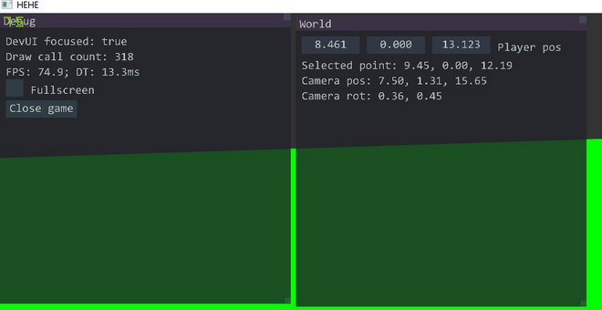
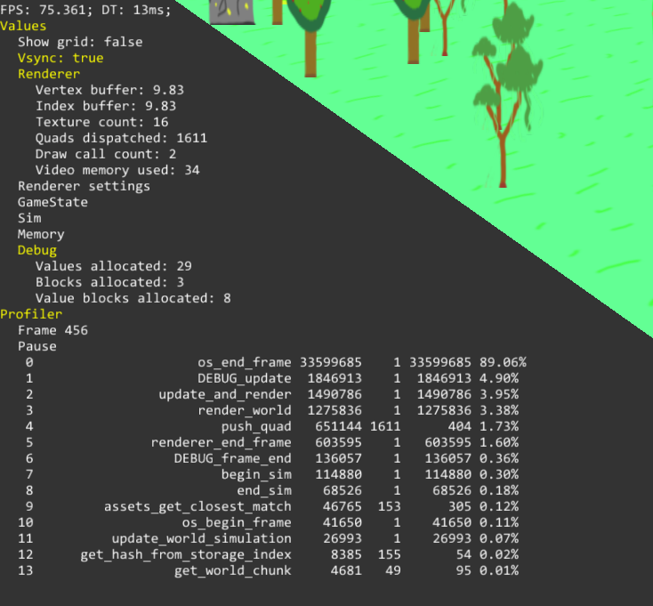
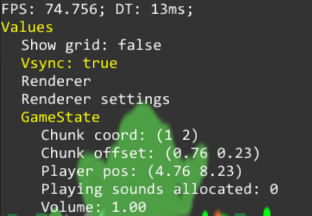
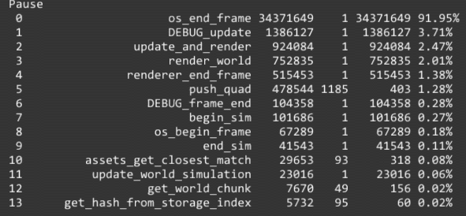

# 7.7.21

Прошел почти месяц с момента начала разработки (первый коммит на гитхабе - 8 июня). Неплохо было бы подвести итоги первого крупного временного отрезка времени, посвященного активной разработке.
Здесь будут написаны мысли по поводу некоторых принятых решений, о причинах и перспективах выборов, и о том, что сделать так и не удалось, и вследствие чего это произошло.

## Краткая предыстория

Идея создать игру появилась давно - еще два года назад. Но по различным причинам, в основном из-за учебы, свободное время не позволяло перейти к интенсивной работе. Поэтому в первый месяц лета, когда времени наконец стало достаточно, было принято решение заняться активной разработкой.
Идеи в корне проекта всегда оставались одними - написать все, что можно самому. Архитектура и стиль кодирования (Обьектно-ориентированный или Ориентированный на данные) мог варьироваться.

## Начало разработки

Работа началась с анализа уже готового кода. Несправедливо было бы говорить, что все составляющие движка были написаны за месяц - некоторые части кода существовали и использовались в других личных проектах уже некоторое время.

Компиляция происходит в стиле, который принято называть single compilation unit build (это не термин - комплириование единого модуля). Все .cc файлы включаются в один, и генерируется только один объектный файл. Это намного быстрей, чем компилирование множества объектных файлов и объединение их в исполняемый позднее, ведь библиотечный код включается и компилируется только один раз. Переход к более традиционному способу компиляции - когда IDE следит, в каких файлах были сделаны изменения, рекомпилирует их, а потом собирает исполняемый файл оправдано только при крайне большом времени компиляции одного модуля или возникновении проблем у компилятора с памятью, что крайне маловероятно для проекта такого размера. Поэтому компиляция файла compile.cc имеет перспективу остаться до конца. Такое более простое решение в итоге оказывается более рациональным, чем традиционные методы. И он не имеет никаких очевидных минусов.

Готовый год был немного обьектно-ориентированным, код условно подразделялся на модули, которые должны были быть как можно более обособленными друг от друга. Однако это осложнялось реалиями нужд этих модулей, которые зачастую требовали доступ к друг другу для чтения и даже записи данных. Поэтому существовало некоторое количество глобальных переменных, что, как было осознано впоследствии, нисколько не помогает для анализа и поддержания чистоты кода.

Первые шаги в работе над проектом представляли собой личный эксперимент в изменении стиля разработки - последний крупный проект был написан на чистом С, а тут предполагалось использования возможностей С++17. Были написаны классы Array, Str, которые повторяли функционал std::vector и std::str. Как выяснилось позднее, это было не лучшее решение, которое повлекло нужду в большом числе изменений.

Отрисовщик представлял собой массив из вершин, которые рисовались динамически по запросам в текчение кадра несколько раз. Это сильно напоминает алгоритм работы старого OpenGL, который принято называть immediate mode (немедленный режим). Это было правильное решение - оно позволило быстро перейти к отображению вещей на экране с минимумом дополнительных действий. Ведь неизвестно, какой способ отрисовке оказался бы эффективным позднее, и более продуманный и оптимизрованный мог бы оказаться неэффективным в ходе дальнейшей работы.

```cpp
void immediate_begin();
void immediate_flush();
void immediate_vertex(const Vertex &v);

void Renderer::draw_rect(Rect rect, Vec4 color) {
    Vertex v0, v1, v2, v3;
    v0.p = Vec3(rect.top_left());
    v0.c = color;
    v1.p = Vec3(rect.top_right());
    v1.c = color;
    v2.p = Vec3(rect.bottom_left());
    v2.c = color;
    v3.p = Vec3(rect.bottom_right());
    v3.c = color;
    
    immediate_begin();
    immediate_vertex(v3);
    immediate_vertex(v1);
    immediate_vertex(v0);
    immediate_vertex(v0);
    immediate_vertex(v2);
    immediate_vertex(v3);
    immediate_flush();
}
```

## Интерфейс разработчика

Пожалуй, это самая сложная и неоднозначная тема. Ведь никогда не знаешь, что может понадобиться от такой системы, и ее приходится изменять. Она может стать слишком сложной, а может оказаться недостаточно функциональной.
Все решения имеют общюю идею - они должны быть immdeiate mode (мгновенный режим). Это значит, что разработчик не должен сообщать позицию и размер каждого виджета, а они строятся динамически. Это помогает в прототипировании и создании выразительного тестового кода:

```cpp
if (dev_ui.checkbox("Fullscreen", &this->settings.fullscreen)) {
    game->os.go_fullscreen(this->settings.fullscreen);
}
if (dev_ui.button("Close game")) {
    game->is_running = false;
}
```

Здесь не будет обьясняться причины выбора и алгоритма работы такого интерфейса, потому что это слишком обширная тема. [Оригинальное видео](https://youtu.be/Z1qyvQsjK5Y)

Большое время было потрачено на создание интерфейса, API которого повторял API Dear Imgui - одного из самых популярных способов создания такого интерфейса. Но вскоре стало понятно, что он явлется слишком сложным



Новая система является упрощением над старой, она почти полностью повторяет функционал, но исключает наличие окон. На момент написания этого текста она позволяет использовать несложные текстовые виджеты - кнопку, чекбокс, слайдер и открываемый раздел.



## Система ассетов

Важное замечание - лучше не переводить asset как актив.
Система ассетов выполняет простую задачу - получение текстур, шрифтов и звуков по запросам игры сложным способом.
Общий объем ассетов сосатвляет значительный объем памяти, и может доходить до нескольких гигабайт. Поэтому система ассетов
должна обеспечивать быстрый гибкий доступ к своему содержимому и при этом отвечать за рациональное использование памяти
Большинство крупных игровых движков используют хеш-таблицы для доступа. Это медленней, чем выбранный для этого проекта способ -
доступ по перечислениям (enums). Каждый ассет в игре имеет уникальный идентификатор, который никогда не менется. Однако это не значит,
что, к примеру, каждая текстурка была бы пронумерована (Asset_Texture1, Asset_Texture2, Asset_Texture3...) - это неудобно и неэффективно. Поэтому
была введена система, позволяющая получать доступ к ассетам на основе перечислений, но без нужды указывать уникальный идентификатор каждый раз.
Система деллит доступ к ассетам на три уровня. Первый уровень обозначает тип ассета, к примеру Asset_Player, Asset_Grass, Asset_WorldObject.
Каждый тип ассета может иметь в себе произвольное число индивидуальных ассетов, об индификаторах которых ничего не известно заранее. Для
получения этих идентификаторов нужно использовать теги - способ связи перечислений с запросами игры.
Когда игре требуется получить текстуру для Asset_WorldObject, она запрашивает у системы текстуру, и передает ей настройки.

```cpp  
AssetTagList tags = {};
AssetTagList weights = {};
tags.tags[ASSET_TAG_WORLD_OBJECT_KIND] = entity->world_object_kind;
weights.tags[ASSET_TAG_WORLD_OBJECT_KIND] = 1000.0f;
tags.tags[ASSET_TAG_BUILDING_IS_BUILT] = (bool)(entity->world_object_flags & WORLD_OBJECT_FLAG_IS_BUILT);
weights.tags[ASSET_TAG_BUILDING_IS_BUILT] = 1.0f;
texture_id = assets_get_closest_match(assets, ASSET_TYPE_WORLD_OBJECT, &weights, &tags);
```

Такому коду безразлично, какой результат ей даст система. Она лишь сообщает о своих запросах.
Данный способ предоставляет большую гибкость. Код получения текстур остается простым, и не должен делать ничего, кроме
сообщения своих -намерений-. То, какие текстуры будут получены, зависит от заданных параметров текстур в текстовом описании.

```info
[ASSET_TYPE_WORLD_OBJECT]
texture "building.png" {
    ASSET_TAG_WORLD_OBJECT_KIND WORLD_OBJECT_KIND_BUILDING1
    ASSET_TAG_BUILDING_IS_BUILT 0.0
}
texture "building1.png" {
    ASSET_TAG_WORLD_OBJECT_KIND WORLD_OBJECT_KIND_BUILDING1
    ASSET_TAG_BUILDING_IS_BUILT 1.0
}
```

В данном примере, художник может добавить еще несколько текстур для здания с другими параметрами строительства, к примеру,
отдельная текстура, если здание построено на 0.5. И это не повлечет изменений в коде игры.
Сами ассеты хранятся в готовом виде в бинарном файле, и игра легко загружает их, тратя минимум времени.
И все это работает очень быстро, отчасти потому что не использует ни одной строки.

### Асинхронная загрузка ассетов

Так и не была внедрена по причине наличия ассетовых файлов. Все ассеты на данный моменты очень малы в размере, и нет никакой нужды
в их отгрузке для соблюдения ограничений памяти - поэтому все загрузки выполняются на главном потоке, и это почти не заметно.
Конечно, в будущем все же будет добавлена асинхронная загрузка, но она абсолютно не нужна на данном этапе.

## Отрисовщик

Отрисовщик был переписан на быструю отрисовку множества четырехугольников. Коду игры предоставляются массивы с вершинами и индексами, в которые
программа постепенно пишет свои запросы на отрисовку. Каждый запрос на отрисовку может иметь произвольное число четырехугольников. Это уменьшает число
запросов к видеокарте и вообще довольно эффективо.
Было введено понятие структуры RenderGroup. Эта структура описывает настройки текущей группы отрисовки. К примеру, различные запросы на отрисовку
четырехугольников могут иметь разные настройки, вроде проекции камеры и наличия глубины изображения. RenderGroup отвечает за то, что запросы с
разными настройками будут корректно обработаны и переданы в виде массивов в отрисовщик.
И публичный интерфейс отрисовщика представляется всего парой полей данных, без использования дополнительных функций

```cpp
struct RendererCommands {
    size_t max_quads_count;
    size_t quads_count;
    RenderQuads *quads;

    size_t max_vertex_count;
    size_t vertex_count;
    Vertex *vertices;

    size_t max_index_count;
    size_t index_count;
    RENDERER_INDEX_TYPE *indices;
    ...
};
```

## Инструменты дебаггинга

Еще одна неодназначная тема. Разработчик должен иметь вомзможность легко получать данные о программе в ходе ее работы. Некоторые
движки решали это проблему, используя консоль, но этот старается избежать ее внедрения. Текущая дебаггинговая система имеет
две основные особенности: доступ к так называемым Debug Values, и profiler.

### Debug Values

Это способ получать отображение значений некоторых переменных во время игры и изменять их.

```cpp
{DEBUG_VALUE_BLOCK("GameState")
    DEBUG_DRAG(&game_state->global_volume, "Volume");
    DEBUG_VALUE(game_state->playing_sounds_allocated, "Playing sounds allocated");
    DEBUG_VALUE(player_pos, "Player pos");
    DEBUG_VALUE(player->world_pos.offset, "Chunk offset");
    DEBUG_VALUE(player->world_pos.chunk, "Chunk coord");
}
```



Как видно на приложеном скрине, все значения отображаются в игре, а громкость, которая была обозначена с DEBUG_DRAG, может быть изменена.
Такая система хорошо справляется с задачей отображения числовых и несложных сруктурных значений.

### Profiler

Способ узнать, сколько времени и какой процент от времени кадра занимает отдельная функция.
Разработочик обозначает блоки для профайлинга с помощью макросов:

```cpp
void test_proc() {
    TIMED_FUNCTION();
    
    BEGIN_BLOCK("Comp1");
    some_computation1();
    END_BLOCK();
    
    {TIMED_BLOCK("Comp2")
        some_compuatation2();
    }
}
```

В приведенном примере будет записано время работы трех блоков - функции test_proc, блока Comp1 и блока Comp2.
Полученные значения могут использоваться для составляния различнов видов анализа кадра, самый простой и наглядный из
которых - сортировка по общему времени исполнения каждого блока. Это очень полезно для анализа того, какие части кода
должны быть оптимизированы. Ведь, как часто говорят, 10% кода занимает 90% времени, и такое средство точечного профайлинга позволяет
легко оценить качество оптимизации определенного блока.



## Depth peeling

В планах было внедрить этот алгоритм отрисовки, но это так и не было выполнено.
Depth peeling призван решать проблему отрисовки прозрачных примитив, которые в противном случае должны иметь сторого определнный
порядок рисования, при нарушении которого дальние примитивы могут быть отрисованы поверх более ближних.
Однако в своем оригинальном виде Depth peeling существует для работы со сложными моделями, состоящими из тысяч треугольников,
которые не могут быть никак отсортированы в разумные сроки. Реалии же этой игры подразумевают более простые модели.
Все они могут быть легко отсортированы по глубине (что выполняется с помощью алгоритма поразрядной сортировки) для получения того
же результата без дополнительной нагрузки на видеокарту.

## World

Мир - это все сущности (Entity), имеющие позиции в игровом пространстве
То, как мир будет использоваться в игре, какие операции будут происходить и из каких обьектов он будет состоять
абсолютно не ясно на данном этапе. Поэтому система мира была сделана максимально простой. Все сущности представлены
одной структурой, имеющей все возможные поля. Сущности хранятся в чанках, а во время кадра загружаются в регион симуляции.
Там они могут менять свои позиции, и в конце кадра снова загружаются в чанки, соотвествующие новым позициям.
То, понадобится ли ECS в этой игре, или такая упрощенная система окажется достаточной для разработки и выпуска, станет ясно позднее.

## Итоги

За первый месяц разработки была написана большая часть полезного кода движка, которая позволяет приступить к разработке игры без затруднений.

## Выводы

1) Контейнеры для типов данных (строки, массивы) не оправдывают траты времени на разработку и использование - они не представляют гибкости в работе с памятью и отдалаяют от разработчика видимость данных в простом виде - он больше не думает о массиве, как о наборе байт, а скорее как о наборе элементов массива.
Если для разработки требуется создать массив, строку, хеш-таблицу - гораздо проще использовать обычный С-массив. Несмотря на то, что неизменяемость его размеров может показаться проблемой, контейнеры не решат ее. Они лишь отдаляют необходимость ее решения. Почти для каждого места использования таких структур данных требуется собственный алгоритм аллокации памяти, и никакой стандартный не может быть эффективным во всех случаях.
2) Писать код, использующий функционал до самого функционала. Другими словами - дизайн системы должен основоваться на ее использовании, а не наоборот. Это наиболее видно по количеству изменений в интерфейсе разработчика, которые так и не привели к удволетворительному результату
3) Динамических аллокаций памяти можно избежать полностью
4) Никто не знает, как что должно работать. Поэтому не стоит смотреть то, как другие решают проблемы
